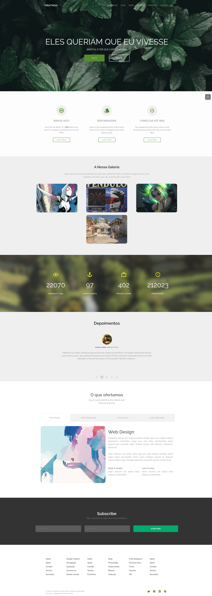
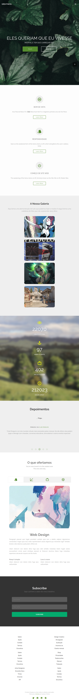
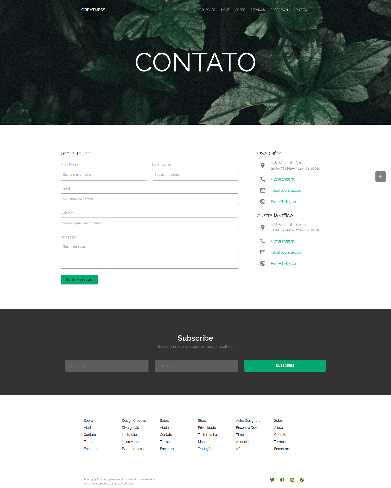
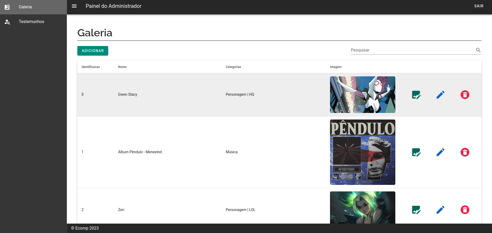

# Projeto de capacitação de Front-End

## Descrição

> "_Projeto de capacitação de um site de Front-End, que é totalmente responsiva, e com uma seção dashboard para edição de certos conteúdos dinâmicos_"

## Rodando a aplicação

```bash
# Colocar a versão do node certa (NVM)
nvm use 16;

# Instalar pacotes e depedências do projeto:
npm install;

# Rodar o projeto
npm run dev;

# Rodar o back-end simulado (json-server)
json-server -w -p 8000 db.json;
```

## Demonstração da aplicação

- Home (computador):
  
- Home (mobile):
  
- Contato:
  
- Dashboard:
  

## Infos

- **Tecnologias**: `Vue2`, `Vuetify2`, `Nuxt2`, `json-server`
- **Data**: 10/09/2023

---


