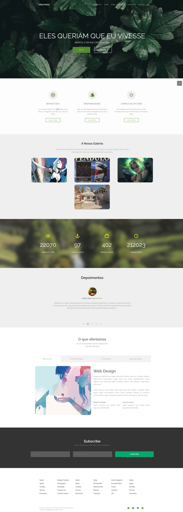
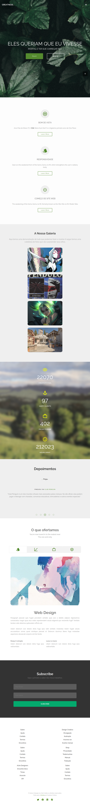
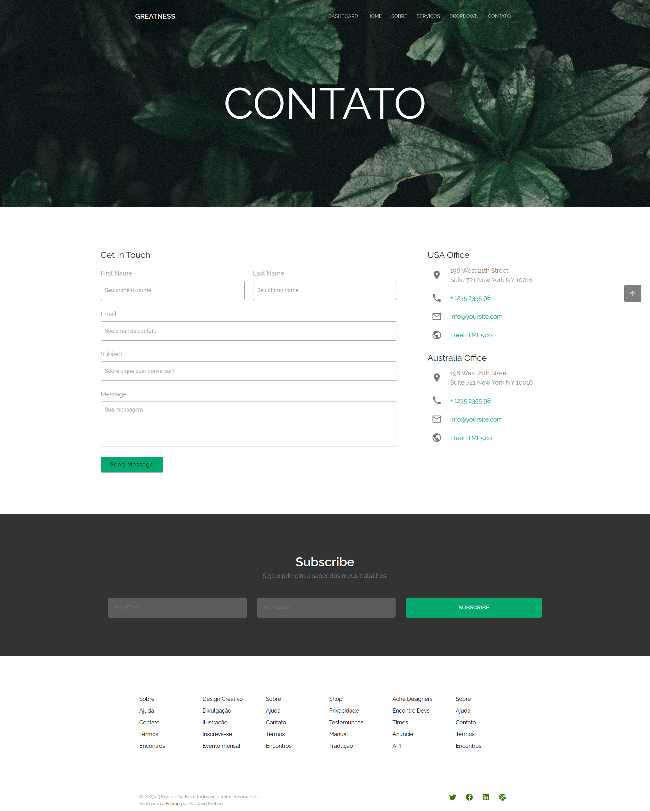
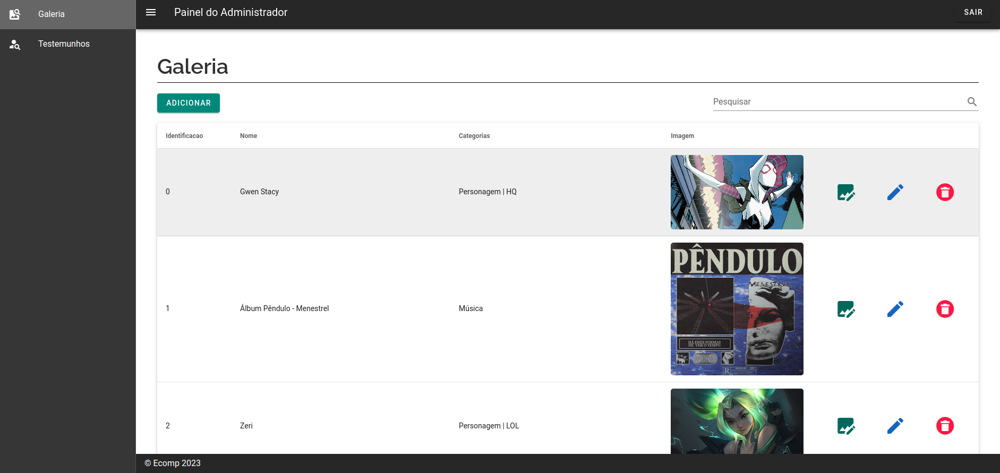

# Landing Page GREATNESS

> [!NOTE]
> Landing Page feito em `Vue 2` e `Nuxt.js` baseado em um layout greatness. Feito como projeto de fixação e capacitação do @tuildes na linguagem na Ecomp [^1]. Sendo totalmente responsiva, contando também com uma dashboard para edição de certos conteúdos dinâmicos da página.

## ☕ Info

- **Layout**: https://demos.freehtml5.co/greatness/index.html
- **Data**: 10/09/2023
- **Linguagem**: `Vue.js 2`, `Vuetify`, `Nuxt`, `json-server`

## 🐛 Comandos

  ```bash
  # Colocar a versão do node certa (NVM)
  nvm use 16;

  # Instalar pacotes e depedências do projeto:
  npm install;

  # Rodar o projeto
  npm run dev;

  # Rodar o back-end simulado (json-server)
  json-server -w -p 8000 db.json;
  ```

## 🚀 Arquivos

    .
    ├── .github                  # Pasta com imagens do README
    ├── assets                   # Pasta com arquivos de build, como css
    ├── components               # Pasta com componentes reutilizáveis (.vue)
    ├── layouts                  # Pasta com layout da aplicação (.vue)
    ├── middleware               # Pasta com middlewares (.js)
    ├── pages                    # Pasta com as páginas e roteamento (.vue)
    ├── static                   # Pasta com imagens estáticas do projeto
    ├── store                    # Pasta que controla a STORE VueX (.js)
    |
    ├── .prettierrc              # Configuração do prettier
    ├── .eslintrc,js             # Configuração do eslint
    ├── db.json                  # Database usada pelo json-server
    ├── jsconfig.json            
    ├── nuxt.config.js           # Configuração do funcionamento da aplicação
    ├── package.json             # Pacotes do proejto
    |
    └── README.md     

## Demonstração da aplicação

- Home (computador):
  
- Home (mobile):
  
- Contato:
  
- Dashboard:
  

[^1]: **Empresa Júnior** de Informática da UFPR - ECOMP. Site: https://ecomp.co/
